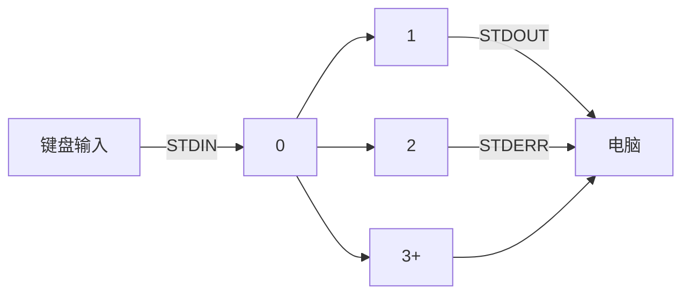

# 文件操作与编辑

## 1、输出重定向

我们知道，Linux 中标准的输入设备默认指的是键盘，标准的输出设备默认指的是显示器。而本节所要介绍的输入、输出重定向，完全可以从字面意思去理解，也就是：

- 输入重定向：指的是重新指定设备来代替键盘作为新的输入设备；
- 输出重定向：指的是重新指定设备来代替显示器作为新的输出设备。

### 1）标准输入、标准输出、标准错误



| 通道编号 | 通道名     | 描述     | 使用方   | 作用           |
| -------- | ---------- | -------- | -------- | -------------- |
| 0        | `STDIN`    | 标准输入 | 用户输入 | 读取输入的内容 |
| 1        | `STDOUT`   | 标准输出 | 终端     | 写入内容       |
| 2        | `STDERR`   | 标准错误 | 终端     | 写入内容       |
| 3+       | `FILENAME` | 其它文件 | 无       | 读取/写入内容  |


### 2）将输出重定向到文件

这里所用到的输出重定向中需要注意的符号：

- `>`：表示覆盖写入；

- `>>`：表示追加写入（即在文件末尾追加新的内容）

使用上述符号时，若需要写入的文件不存在，则会自动新建文件并写入！

具体用法：`<command> [> / >> / 2> / 2>> / &> / &>>] <file>`

- `>` / `1>` ：（其中的 `1` 可忽略）输出符号，用于将命令的输出结果 **覆盖写入** 指定文件中

  - 执行此符号后，将会执行如下图所示：

    ```mermaid
    graph LR
    键盘输入 -- STDIN --> 0
    0 --> 1 -- STDOUT --> 文件
    0 --> 2 -- STDERR --> 电脑
    ```

    

  - 示例：将四个文件写入至新的文件中

    ````
    [user@localhost dict]$ cat a.file b.file c.file > new.file
    ````

- `>>`：追加输出符号，用于将命令的输出结果 **追加写入** 指定文件中

  - 示例：将当前登录的用户名追加写入至 `now.txt` 文件中

    ```shell
    [user@localhost ~]$ whoami >> now.txt
    [user@localhost ~]$ cat now.txt
    2022年 11月 11日 星期五 02:47:01 EST
    user
    ```

- `2>`：错误输出符号，将输出的报错结果 **覆盖写入** 到指定文件中（将报错信息全部抛出）

  - 图例：

    ```mermaid
    graph LR
    键盘输入 -- STDIN --> 0
    0 --> 1 -- STDOUT --> 电脑
    0 --> 2 -- STDERR --> 文件
    ```

  - 示例：从 `/` 目录下搜索 `python3` 的文件 ，并将查找到的结果输出到电脑中

    ```shell
    [user@localhost ~]$ find / -name python3 2> /dev/null 
    /etc/alternatives/python3
    /var/lib/alternatives/python3
    /usr/bin/python3
    /usr/share/bash-completion/completions/python3
    ```

    > 💡 **扩展：`/dev/null`—— 黑洞**
    >
    > `/dev/null` 在 Linux 中其实是一个**空设备文件**。它天生就自命不凡，与普通文件划清界限。
    >
    > 其它文件遇到键盘输入的内容将存入其中，**而 `/dev/null` 对于键盘输入的内容通通扔掉**。
    >
    > 示例：使用 echo 命令将输出的结果丢入黑洞，再查看该文件，发现该文件没有任何内容
    >
    > ```shell
    > [root@localhost user]# echo "Hello world！" > /dev/null
    > [root@localhost user]# cat /dev/null
    > [root@localhost user]#
    > ```

- `2>>`: 将输出的报错结果 **追加写入** 到指定文件中

- `&>`: 将所有输出的内容（包含错误输出内容）**覆盖写入**至文件

  - 图例：

    ```mermaid
    graph LR
    键盘输入 -- STDIN --> 0
    0 --> 1 -- STDOUT --> 文件
    0 --> 2 -- STDERR --> 文件
    ```

  - 示例：使用 user 用户在 `/` 目录下查找 `passwd` 的文件

    ```java
    [user@localhost ~]$ find / -name passwd &> out.log
    [user@localhost ~]$ cat out.log | less
    find: ‘/boot/efi’: Permission denied
    ...
    /usr/bin/passwd
    /usr/share/licenses/passwd
    /usr/share/doc/passwd
    /usr/share/bash-completion/completions/passwd
    find: ‘/usr/share/polkit-1/rules.d’: Permission denied
    find: ‘/usr/share/selinux/targeted/default/active’: Permission denied
    find: ‘/usr/libexec/initscripts/legacy-actions/auditd’: Permission denied
    ...
    ```

- `&>>` : 将所有输出的内容（包含错误输出内容）**追加写入**至文件


### 3）管道符

**管道**是一个或多个命令的序列，**用 `|` 分割**，是将第一个命令的输出结果（STDOUT）作为下一个命令的输入内容（STDIN）。


为便于理解，你可以这么想象：将一个物品放入包裹中，然后通过管道流向另一个地方，将这个包裹里的每一样东西进行修整并将其打包

示例 1：查看 `/usr/share` 目录下有多少个目录及文件

```java
[user@localhost ~]$ ls /usr/share/ | wc -l
210
```

`ls` 的输出结果会通过管道流向 `less`，通过 `wc -l`  来统计 `ls`  的输出结果，并将总行数输出到终端上。

示例 2：在 `/bin` 目录下查找所有包含 `python` 的目录及文件

```java
[user@localhost ~]$ ls /bin/ | grep python
python3
python3.6
python3.6m
unversioned-python
```

### 4）
