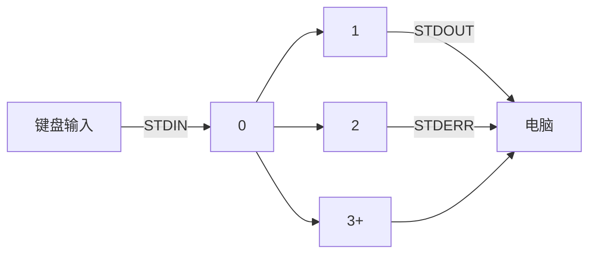
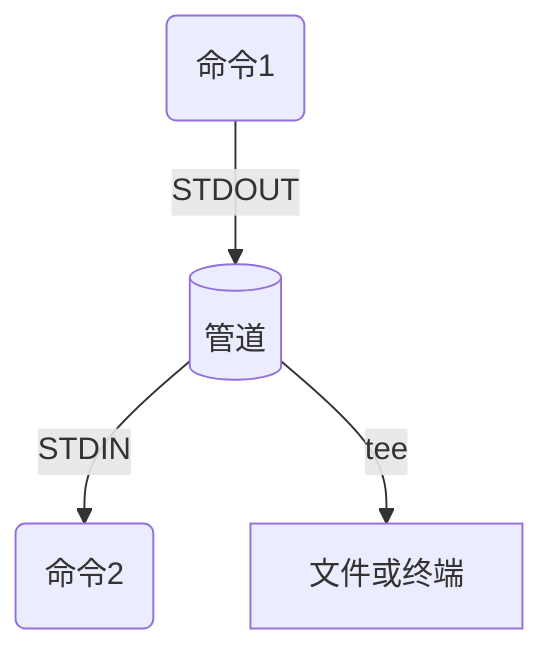

# 文件操作与编辑

## 1、输出重定向

> 📖 **学前需知**
>
> 我们知道，Linux 中标准的输入设备默认指的是键盘，标准的输出设备默认指的是显示器。两者完全可以从字面意思去理解，也就是：
>
> - 输入重定向：指的是重新指定设备来代替键盘作为新的输入设备；
> - 输出重定向：指的是重新指定设备来代替显示器作为新的输出设备。
>

### 1）标准输入、标准输出、标准错误



| 通道编号 | 通道名     | 描述     | 使用方   | 作用           |
| -------- | ---------- | -------- | -------- | -------------- |
| 0        | `STDIN`    | 标准输入 | 用户输入 | 读取输入的内容 |
| 1        | `STDOUT`   | 标准输出 | 终端     | 写入内容       |
| 2        | `STDERR`   | 标准错误 | 终端     | 写入内容       |
| 3+       | `FILENAME` | 其它文件 | 无       | 读取/写入内容  |


### 2）将输出重定向到文件

这里所用到的输出重定向中需要注意的符号：

- `>`：表示覆盖写入；

- `>>`：表示追加写入（即在文件末尾追加新的内容）

使用上述符号时，若需要写入的文件不存在，则会自动新建文件并写入！

- `>` / `1>` ：（其中的 `1` 可忽略）输出符号，用于将命令的输出结果 **覆盖写入** 指定文件中

  - 执行此符号后，将会执行如下图所示：

    ```mermaid
    graph LR
    键盘输入 -- STDIN --> 0
    0 --> 1 -- STDOUT --> 文件
    0 --> 2 -- STDERR --> 电脑
    ```

    

  - 示例：将四个文件写入至新的文件中

    ````
    [user@localhost dict]$ cat a.file b.file c.file > new.file
    ````

- `>>`：追加输出符号，用于将命令的输出结果 **追加写入** 指定文件中

  - 示例：将当前登录的用户名追加写入至 `now.txt` 文件中

    ```shell
    [user@localhost ~]$ uptime > test.txt
    [user@localhost ~]$ who >> test.txt 
    [user@localhost ~]$ cat test.txt 
     05:17:30 up 27 min,  1 user,  load average: 0.00, 0.00, 0.00
    root     pts/0        2023-02-23 05:14 (192.168.56.1)
    ```

- `2>`：错误输出符号，将输出的报错结果 **覆盖写入** 到指定文件中（将报错信息全部抛出）

  - 图例：

    ```mermaid
    graph LR
    键盘输入 -- STDIN --> 0
    0 --> 1 -- STDOUT --> 电脑
    0 --> 2 -- STDERR --> 文件
    ```

  - 示例：从 `/` 目录下搜索 `python3` 的文件 ，并将查找到的结果输出到电脑中

    ```shell
    [user@localhost ~]$ find / -name python3 2> /dev/null 
    /etc/alternatives/python3
    /var/lib/alternatives/python3
    /usr/bin/python3
    /usr/share/bash-completion/completions/python3
    ```

    > 📚 **扩展：`/dev/null`—— 黑洞**
    >
    > `/dev/null` 在 Linux 中其实是一个**空设备文件**。它天生就自命不凡，与普通文件划清界限。
    >
    > 其它文件遇到键盘输入的内容将存入其中，**而 `/dev/null` 对于键盘输入的内容通通扔掉**。
    >
    > 示例：使用 echo 命令将输出的结果丢入黑洞，再查看该文件，发现该文件没有任何内容
    >
    > ```shell
    > [root@localhost user]# echo "Hello world！" > /dev/null
    > [root@localhost user]# cat /dev/null
    > [root@localhost user]#
    > ```

- `2>>`: 将输出的报错结果 **追加写入** 到指定文件中

- `&>`: 将所有输出的内容（包含错误输出内容）**覆盖写入**至文件

  - 图例：

    ```mermaid
    graph LR
    键盘输入 -- STDIN --> 0
    0 --> 1 -- STDOUT --> 文件
    0 --> 2 -- STDERR --> 文件
    ```

  - 示例：使用 user 用户在 `/` 目录下查找 `passwd` 的文件

    ```java
    [user@localhost ~]$ find / -name passwd &> out.log
    [user@localhost ~]$ cat out.log | less
    find: ‘/boot/efi’: Permission denied
    ...
    /usr/bin/passwd
    /usr/share/licenses/passwd
    /usr/share/doc/passwd
    /usr/share/bash-completion/completions/passwd
    find: ‘/usr/share/polkit-1/rules.d’: Permission denied
    find: ‘/usr/share/selinux/targeted/default/active’: Permission denied
    find: ‘/usr/libexec/initscripts/legacy-actions/auditd’: Permission denied
    ...
    ```

- `&>>` : 将所有输出的内容（包含错误输出内容）**追加写入**至文件

- `> FILE 2>&1` ：将标准输出及错误输出 **覆盖写入** 到文件中

  - 图例：

    ```mermaid
    graph LR
    键盘输入 -- STDIN --> 0
    0 --> 1 -- STDOUT --> 文件
    0 --> 2 -- STDERR --> 文件
    ```

  - 示例：

    ```java
    [user@localhost ~]$ ls
    Doc_A  Doc_B
    [user@localhost ~]$ mkdir Doc_{A..Z} > err.log 2>&1
    [user@localhost ~]$ cat err.log 
    mkdir: 无法创建目录 “Doc_A”: 文件已存在
    mkdir: 无法创建目录 “Doc_B”: 文件已存在
    ```

- `>> FILE 2>&1`：将标准输出及错误输出 **追加写入** 到文件中


### 3）管道符

#### 1. 概述

**管道**是一个或多个命令的序列，**用 `|` 分割**，是将第一个命令的输出结果（STDOUT）作为下一个命令的输入内容（STDIN）。


为便于理解，你可以这么想象：将一个物品放入包裹中，然后通过管道流向另一个地方，将这个包裹里的每一样东西进行修整并将其打包

示例 1：查看 `/usr/share` 目录下有多少个目录及文件

```java
[user@localhost ~]$ ls /usr/share/ | wc -l
210
```

`ls` 的输出结果会通过管道流向 `less`，通过 `wc -l`  来统计 `ls`  的输出结果，并将总行数输出到终端上。

示例 2：在 `/bin` 目录下查找所有包含 `python` 的目录及文件

```java
[user@localhost ~]$ ls /bin/ | grep python
python3
python3.6
python3.6m
unversioned-python
```

> 💡 **提示**
>
> 通过 `grep` 命令，它能将管道前面的输出的结果进行筛选，并将匹配到包含此关键字符的行打印出来
>
> 在该例子中，若要在 `/bin` 目录下查找包含 `Python` 相关的文件，就可以使用 `grep` 来搜寻。

#### 2. 👍 `grep` 行文本筛选

##### 1）基本格式

固定格式1：`grep [options] <keyword> <file>` （可以在文件中筛选包含的行）

固定格式2：`<command> | grep [Options] <keyword>`（配合管道符筛选包含的行）

| 选项 | 参数       | 意义               |
| ---- | ---------- | ------------------ |
| `-A` | `<number>` | 查看前 number 行   |
| `-B` | `<number>` | 查看后 number 行   |
| `-C` | `<number>` | 查看前后 number 行 |
| `-i` |            | 不区分大小写       |
| `-v` |            | 反向筛选           |

##### 2）常用的正则表达式

| 字符  | 解释     | 示例                                     |
| ----- | -------- | ---------------------------------------- |
| `^`   | 开头符   | `^python`：查找以 python 为开头的内容    |
| `$`   | 结束符   | `.md$`：查找以 md 为结尾的内容           |
| `*`   | 任意符   | `*py*`：查找所有含有py的内容             |
| `[]`  | 包含符   | `[A-Za-z]`：查找包含大小写字母的所有内容 |
| `[^]` | 非包含符 | `[^$]`：查找文件内除空行以外的所有内容   |

> 🔗 **相关内容**
>
> 了解更多可用的正则表达式，请跳转到：🔖 [正则表达式](../Extra/Expression.md) 以查看更多

##### 3）管道与重定向

当管道与重定向组合时，首先程序将会先设置整个管道，然后再进行重定向输入与输出。

若在管道中间使用 `>` 或 `>>` 等其它输出重定向 ，管道将只会通往文件，而不会通往下一个命令。

如下例：使用 `lscpu` 命令，将输出的内容写入至文件中，并且 `|` 后面的 `more` 命令将不会显示在终端上。

```java
[root@localhost words]# lscpu > /tmp/cpuinfo | more
```

#### 3.  `tee` 与管道

为了打破这个限制，使用 `tee` 命令不仅能将前一命令的输出结果复制并写入至文件中，而且还能将前一命令的输出结果复制作为后一命令的参数。为了便于理解，如下图：



示例 1：查看 `/etc` 下的所有内容并写入到 `findout.log` 文件中，并且将输出内容传递到 `less` 命令中，实现在终端中查看文件内容

```java
[root@localhost Test]# ls /etc/ | tee findout.log | less
```

示例 2：若 `tee` 在管道的最末位，则可以保存命令的输出内容并同时输出到终端。

```java
[root@localhost Test]# ls /usr/ | head -n 5 | tee content.log
bin
config
games
include
lib
```

> ❗ **注意**
>
> 你可以使用管道来使用重定向标准错误 `STDERR`，但不能使用 `&>` 和 `&>>` 来执行：
>
> 以下是正确使用方式：
>
> ```java
> [user@localhost ~]$ sudo find / -name python* 2>&1 | more
> ```


## 2、👍 简单使用 VIM 文本编辑器

### 1. 安装和启动

#### 1）安装

```shell
# Ubuntu / Debian 系
$ sudo apt install vim -y

# CentOS / Red Hat 系
$ sudo yum install vim -y
```

#### 2）启动

```shell
$ vim <文件名>
```

### 2. 使用方法

#### 1）模式切换

默认模式（末行模式）：需用`:<Command>`来执行保存、退出、查找替换、显示行号等操作

插入模式（Insert）：编辑文本内容

替换模式（Replace）：覆盖编辑文本内容

可视模式（Visual）：选择文本区域，并进行复制、剪切、删除操作

> 💡 提示：终端界面的左下角处可直接查看当前模式

| 快捷键                       | 作用                                        |
| ---------------------------- | ------------------------------------------- |
| <kbd>I</kbd> / <kbd>i</kbd>  | 进入插入模式（Insert）                      |
| <kbd>o</kbd>（小写）         | 换行并进入插入模式（Insert）                |
| <kbd>O</kbd>（大写）         | 在上方插入一行并进入插入模式（Insert）      |
| <kbd>Insert</kbd>            | 切换插入模式（Insert）或替换模式（Replace） |
| <kbd>v</kbd>（小写）         | 进入选择（可视）模式（Visual）              |
| <kbd>V</kbd>（大写）         | 进入行选择（可视行）模式（Visual Line）     |
| <kbd>Ctrl</kbd>+<kbd>V</kbd> | 进入列选择（可视列）模式（Visual Block）    |
| <kbd>Esc</kbd>               | 切换回默认模式（末尾模式）                  |

#### 2）编辑文本

1. 在默认模式（末行模式）下：

   | 命令                          | 作用                  | 注释                     |
   | ----------------------------- | --------------------- | ------------------------ |
   | `c[n]c` / `[n]cc`             | 在当前光标下剪切 n 行 | 键入 `cc` 时默认剪切一行 |
   | `y[n]y` / `[n]yy`             | 在当前光标下复制 n 行 | 键入 `yy` 时默认复制一行 |
   | `p`                           | 在当前光标下粘贴文本  |                          |
   | `d[n]d` / `[n]dd`             | 在当前光标下删除 n 行 | 键入 `dd` 时默认删除一行 |
   | `[n]gg`                       | 跳转至第 n 行         | 键入 `gg` 快速跳转至行首 |
   | <kbd>Shift</kbd>+<kbd>G</kbd> | 快速跳转至行尾        |                          |
   | <kbd>U</kbd>                  | 撤销操作              |                          |
   | <kbd>Ctrl</kbd>+<kbd>R</kbd>  | 重复之前被撤销的操作  |                          |

2. 在可视模式（Visual）下，选择文本区域后：

   | 操作         | 作用         |
   | ------------ | ------------ |
   | <kbd>C</kbd> | 剪切所选内容 |
   | <kbd>Y</kbd> | 复制所选内容 |
   | <kbd>P</kbd> | 粘贴所选内容 |

> 💡 **提示**
>
> 编辑文件时，若想在每一行都显示行号，请在默认模式下执行：`:set nu` / `:set number` ，
>
> 如果想要隐藏行号，则执行：`:unset nu` / `:unset number`

#### 3）查找替换

在默认模式（末行模式）下：

| 输入                         | 作用                           | 注释                                                   |
| ---------------------------- | ------------------------------ | ------------------------------------------------------ |
| `/<keyword>`                 | 查找关键字                     | 按 <kbd>n</kbd> 查找下一个，按 <kbd>N</kbd> 查找上一个 |
| `/<keyword>\c`               | **（不区分大小写）查找关键字** | 同`/<keyword>`操作                                     |
| `:s/<keyword>/<replace>[/g]` | 替换关键字                     | `/g` 表示整行替换                                      |
| `:%s/<keyword>/<replace>`    | 替换所有关键字                 |                                                        |

#### 4）保存退出

默认模式（末行模式）下：

| 输入  | 作用                   |
| ----- | ---------------------- |
| `:q`  | 退出                   |
| `:q!` | 强制退出（不保存退出） |
| `:w`  | 保存                   |
| `:wq` | 保存退出               |

> 💡 提示：关于更多 Vim 使用用法，请执行：`vimtutor zh` 

