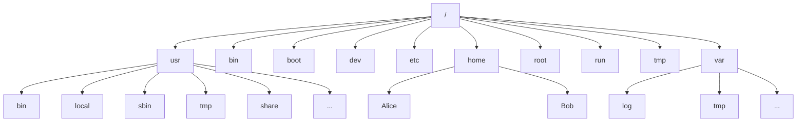

# 文件管理

## 1、文件系统层次结构

> 🕮 **引言**
>
> Linux 系统中的所有文件存储在文件系统中，它们被组织到一个颠倒的目录树中，称为**文件系统层次结构**。

目录树是颠倒的，因为树根在该层次结构的顶部，树根的下方延伸出目录和子目录的分支。

其中的 `/` 为根目录，是整个文件系统层次的最顶部。`/` 还用作目录分割符。如：`/home` 表示 `/` 目录下的 `home` 目录。若`/home` 下还有个名为 `Alice` 的文件夹，则可以将其表示成 `/home/Alice`。下图为 Linux 系统下重要的文件系统目录： 



|    名称 | 解释                                                         |
| ------: | ------------------------------------------------------------ |
|     `/` | 根目录（即整个系统的目录）                                   |
|  `/bin` | 二进制文件目录                                               |
| `/boot` | 系统开机启动时所需的目录                                     |
|  `/dev` | 设备（块）目录（用于访问设备）                               |
|  `/etc` | 系统配置目录                                                 |
| `/home` | 用户目录（家目录），包含了所有用户文件                       |
|  `/lib` | 库目录                                                       |
|  `/mnt` | 手动挂载目录                                                 |
|  `/opt` | 软件安装目录                                                 |
| `/root` | root 超级用户目录                                            |
|  `/tmp` | 临时目录                                                     |
|  `/usr` | 安装的软件、库，包含文件和只读程序数据。重要的子目录有<br />`/usr/bin`：用户命令<br />`/usr/sbin`：系统管理命令<br />`/usr/local`：本地自定义软件 |
|  `/var` | 存放日志、临时文件、数据库、缓存等动态变化的文件             |


> ❗ **注意**
>
> 在红帽系发行版 7 以前的版本中，`/` 下的四个目录文件与现在 `/usr` 目录下的内容是大致相同的。分别如下：
>
> `/bin` <–> `/usr/bin`
>
> `/sbin` <–> `/usr/sbin`
>
> `/lib`<–> `/usr/lib`
>
> `lib64` <–> `/usr/lib64`


## 2、命令行管理

为了更好地展示如何操作或访问文件，这里将作简要地介绍

#### 1）相对路径、绝对路径

- 相对：在**当前路径下**前往哪个路径

- 绝对：具体前往哪个路径
- 例：假设当前工作目录为 `/usr/share`，若想切换到`/usr/bin/` 工作目录，需执行下方指令：
  - 相对路径下：`cd ../bin`
  - 绝对路径下：`cd /usr/bin`


#### 2）相对路径的特殊用法

- `.`：当前目录
- `..`：上一级目录（父目录）
- `../../`：回到上两级目录
- `../../../../`....：回到上 n 级目录

#### 3）导航路径

`cd` 可以切换当前的工作路径；

`pwd` 可以详细查看当前的工作路径；

`ls` 可列出当前路径下的所有内容（目录及文件）

如下例：

```java
[user@localhost ~]$ pwd
/home/user
[user@localhost ~]$ ls
公共  模板  视频  图片  文档  下载  音乐  桌面
[user@localhost ~]$ cd 文档
[user@localhost 文档]$ 
```

> 💡 **提示**：
>
> 其中的 `~` 表示当前为用户主目录（即 `/home/user` 目录）

`ls` 下有多种选项，用于显示文件的属性。其中，最为常见且有用的选项为 `-l`  （长列表）、`-a` （显示隐藏文件及目录）

如下例：

```java
[user@localhost ~]$ ls -l
总用量 4
drwxr-xr-x. 2 user user    6 2月  19 08:26 公共
drwxr-xr-x. 2 user user    6 2月  19 08:26 模板
drwxr-xr-x. 2 user user    6 2月  19 08:26 视频
drwxr-xr-x. 2 user user    6 2月  19 08:26 图片
drwxr-xr-x. 2 user user    6 2月  19 08:26 文档
drwxr-xr-x. 2 user user    6 2月  19 08:26 下载
drwxr-xr-x. 2 user user    6 2月  19 08:26 音乐
drwxr-xr-x. 2 user user    6 2月  19 08:26 桌面
[user@localhost ~]$ ls -al
总用量 40
drwx------. 14 user user 4096 2月  19 23:56 .
drwxr-xr-x.  3 root root   18 2月  18 09:51 ..
drwxr-xr-x.  2 user user    6 2月  19 08:26 公共
drwxr-xr-x.  2 user user    6 2月  19 08:26 模板
drwxr-xr-x.  2 user user    6 2月  19 08:26 视频
drwxr-xr-x.  2 user user    6 2月  19 08:26 图片
drwxr-xr-x.  2 user user    6 2月  19 08:26 文档
drwxr-xr-x.  2 user user    6 2月  19 08:26 下载
drwxr-xr-x.  2 user user    6 2月  19 08:26 音乐
drwxr-xr-x.  2 user user    6 2月  19 08:26 桌面
-rw-------.  1 user user  258 2月  19 08:40 .bash_history
-rw-r--r--.  1 user user   18 8月   2 2022 .bash_logout
-rw-r--r--.  1 user user  141 8月   2 2022 .bash_profile
-rw-r--r--.  1 user user  376 8月   2 2022 .bashrc
drwxr-xr-x. 14 user user 4096 2月  19 08:27 .cache
drwx------. 12 user user 4096 2月  19 08:27 .config
-rw-------.  1 user user   16 2月  19 08:25 .esd_auth
-rw-------.  1 user user  930 2月  19 23:56 .ICEauthority
drwx------.  3 user user   19 2月  19 08:25 .local
drwxrw----.  3 user user   19 2月  19 08:26 .pki
```

> 💡 **提示**
>
> 其中，隐藏文件及目录的名称均为 `.` 为开头。


#### 4）常用文件管理命令

| 命令                  | 作用               |
| --------------------- | ------------------ |
| `mkdir <dir>`         | 创建目录           |
| `cp <file1> <file2>`  | 复制文件           |
| `cp -r <dir1> <dir2>` | 复制目录及其内容   |
| `mv <file1> <file2>`  | 重命名文件         |
| `mv <file> <dir>`     | 移动文件           |
| `rm <file>`           | 删除文件           |
| `rm -rf <dir>/<file>` | 强制删除文件及目录 |

> 💡 **提示**
>
> 关于更多的文件管理命令，请查询：🔖 [Shell 命令速查表](../Extra/Shell-Command.md) 中的第二节


#### 5）特殊符号扩展

- `~` 表示用户的家目录，也能表示某个用户的主目录

  ```java
  [user@localhost ~]$ echo ~
  /home/user
  [user@localhost ~]$ echo ~alice
  /home/alice
  [user@localhost ~]$ echo ~root
  /root
  ```

- `?` 可替代**单个**未知字符

  ```java
  [user@localhost test]$ ls -d python??
  python36
  ```

- `*` 可替代**多个**未知字符

  ```java
  [user@localhost test]$ ls -d python3*
  python36                  python3-lxml         python3-pytz
  python3-blivet            python3-meh          python3-pyudev
  python3-chardet           python3-ntplib       python3-pyxdg
  python3-cups              python3-ordered-set  python3-pyyaml
  python3-dasbus            python3-pexpect      python3-requests
  python3-dateutil          python3-pid          python3-requests-file
  python3-dbus              python3-pip          python3-requests-ftp
  python3-decorator         python3-ply          python3-setuptools
  python3-dnf-plugins-core  python3-productmd    python3-simpleline
  python3-gobject-base      python3-psutil       python3-six
  python3-gpg               python3-ptyprocess   python3-slip
  python3-html5lib          python3-pyatspi      python3-slip-dbus
  python3-idna              python3-pycurl       python3-syspurpose
  python3-kickstart         python3-pydbus       python3-unbound
  python3-libs              python3-pyparted     python3-urllib3
  python3-libxml2           python3-pysocks      python3-webencodings
  ```

- `{}` 大括号扩展

  - `{<value1>,<value2> [,<value3>...]}`：表示确定的集合

    - 如新建文件，名字从 1 月到 6 月可写成：`{1,2,3,4,5,6}月`

      ```java
      [user@localhost test]$ touch {1,2,3,4,5,6}月
      [user@localhost test]$ ls
      1月  2月  3月  4月  5月  6月
      ```

    - 如新建路径，名字从 `周一` 至 `周五` 可写成： `周{一,二,三,四,五}`

      ```java
      [user@localhost test]$ mkdir 周{一,二,三,四,五}
      [user@localhost test]$ ls
      周二  周三  周四  周五  周一
      ```

  - `{<value1>...<value2>}`：表示范围

    - 如：1-10 可写成：`{1..10}`

      ```java
      [user@localhost test]$ touch file{1..10}
      [user@localhost test]$ ls
      file1  file2  file3  file4  file5  file6  file7  file8  file9  file10
      ```

    - 如：大写字母 (A-Z) 可写成`{A..Z}`

      ```java
      [user@localhost test]$ touch test{A..Z}
      [user@localhost test]$ ls
      testA  testD  testG  testJ  testM  testP  testS  testV  testY
      testB  testE  testH  testK  testN  testQ  testT  testW  testZ
      testC  testF  testI  testL  testO  testR  testU  testX
      ```

  - `{}`可以重复和嵌套使用

    - 如：从第一季第1集到第四季第12集可写成：`第{1..4}季第{1..12}集`
    
      ```java
      [root@localhost test]# touch 第{1..4}季第{1..12}集
      [root@localhost test]# ls
      第1季第10集  第1季第6集   第2季第2集  第3季第10集  第3季第6集   第4季第2集
      第1季第11集  第1季第7集   第2季第3集  第3季第11集  第3季第7集   第4季第3集
      第1季第12集  第1季第8集   第2季第4集  第3季第12集  第3季第8集   第4季第4集
      第1季第1集   第1季第9集   第2季第5集  第3季第1集   第3季第9集   第4季第5集
      第1季第2集   第2季第10集  第2季第6集  第3季第2集   第4季第10集  第4季第6集
      第1季第3集   第2季第11集  第2季第7集  第3季第3集   第4季第11集  第4季第7集
      第1季第4集   第2季第12集  第2季第8集  第3季第4集   第4季第12集  第4季第8集
      第1季第5集   第2季第1集   第2季第9集  第3季第5集   第4季第1集   第4季第9集
      ```
    
    - 如：从 A1 到 D4（A 和 D 包含 1~4 的后缀）可写成： `{A{1..4},B,C,D{1..4}}`
    
      ```java
      [root@localhost test]# touch {A{1..4},B,C,D{1..4}}
      [root@localhost test]# ls
      A1  A2  A3  A4  B  C  D1  D2  D3  D4
      ```
    
      

- `$(command)`：命令替换，表示命令**执行正确**后的输出结果

  ```java
  [root@localhost ~]# echo "日期: " $(date +%F) 
  日期:  2023-02-20
  ```

- `VAR=value`：变量扩展。定义变量并赋值。调用变量一般以 `$` 符为头

  ```java
  [root@localhost ~]# NAME=Tony
  [root@localhost ~]# echo $NAME
  Tony
  ```

> 💡 **提示**
>
> 在 Shell 中，有些字符有特殊含义。若**要防止特殊符号被扩展，可以将字符串或字符加上单引号 `'` 包括起来**。
>
> **或者使用反斜杠 `\` 来转义后面一个字符**。如下例：
>
> ```java
> [user@localhost test]$ echo USA: '$100'
> USA: $100
> [user@localhost test]$ echo "USA: \$100"
> USA: $100
> ```

