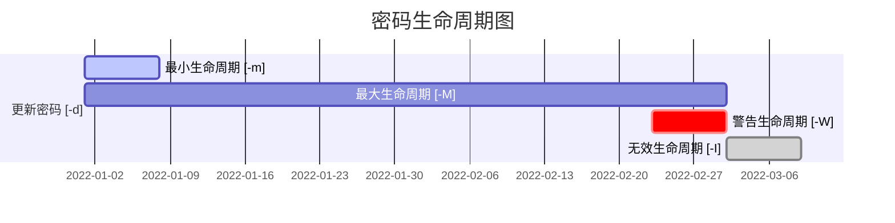

## 用户管理

### 💡 学前需知

- 用户（User）：表示个体

- 用户组（Group）：由多个用户所组成

- UID（User ID）：每个用户独有的标识号（用于辨识用户），同时表示用户的优先级别

  - UID 范围

    | UID   | 表示        | 注释                                  |
    | ----- | ----------- | ------------------------------------- |
    | 0     | root        |                                       |
    | 1~200 | System-User | 用于系统管理 （如：服务，非系统登录） |
    | 1000+ | 普通用户    |                                       |

- GID（Group ID）：每个组独有的标识号（用于辨识所属组），与 `UID` 类似

- WHEEL （管理员组）：默认情况下，加入 `wheel` 组的用户将成为管理员

- ROOT（超级管理员 `uid=0`）：具有系统的最高权限

### 1、查看用户及组

以下介绍了几个比较重要的文件：

- `/etc/passwd`： 可直接查看所有用户信息

  - 文件内容示例

    ```python
    user:x:1000:1000:user:/home/user:/bin/bash
    ```

    `user`：用户名

    `x`：存放密码

    `1000`：UID（用户 ID）

    `1000`：GID（组 ID）

    `user`：所属组名

    `/home/user`：默认工作目录

    `/bin/bash`：登录 Shell 方式

- `/etc/group`：查询所有用户组的信息

  - 文件内容示例

    ```
    user:x:1000:user
    ```

    `user`：组名

    `x`：存放密码

    `1000`：GID

    `user`：附属组

- `/etc/shadow`：存放所有用户的密码

> 💡 **提示**：
>
> 快速查看已存在的用户
>
> - 使用 `id` 命令可直接查看当前用户的简要信息
>
> - 使用 `id [USER]` 命令可查看指定用户的简要信息
>
>   ```python
>   [user@localhost ~]$ id
>   uid=1000(user) gid=1000(user) 组=1000(user),10(wheel)
>   [user@localhost ~]$ id root
>   uid=0(root) gid=0(root) 组=0(root)
>   ```
>
>   > `group` 中的 `1000(user)` 属于主组（Primary Group），`10(wheel)` 属于附属组（Supplementary Group）

### 2、 用户和用户组

#### 1）用户

- 创建普通用户 [ `useradd` ]

  - 简单用法：`useradd <用户名>`**（此指令将新增用户、同用户名的组）**

  - 具体用法

    | 选项 | 参数                    | 注释                                                         |
    | ---- | ----------------------- | ------------------------------------------------------------ |
    | `-g` | `<GroupName>` / `<GID>` | **【👎：不推荐】** 设置已有的用户组，不创建同名组             |
    | `-G` | `<GroupName>` / `<GID>` | 创建附属组**（附带 `wheel` 组即为管理员）**                  |
    | `-m` |                         | 创建用户的主目录及邮件池                                     |
    | `-d` | `<path>`                | 指定新用户的主目录                                           |
    | `-s` | `<Shell>`               | 设置 shell 方式**（影响登录）** <br />**❗：当参数为 `/sbin/nologin` 时则表示用户不可登录系统！** |
    | `-u` | `<UID>`                 | 指定新用户的 UID                                             |
    | `-U` |                         | 创建同用户名的组                                             |

- 修改普通用户 [ `usermod` （与 `useradd` 类似）]

  - 具体用法

    | 选项 | 参数                    | 注释                        |
    | ---- | ----------------------- | --------------------------- |
    | `-a` | `<GroupName>`           | 新增一个附属组              |
    | `-g` | `<GroupName>` / `<GID>` | 修改主组                    |
    | `-G` | `<GroupName>` / `<GID>` | 修改附属组                  |
    | `-u` | `<UID>`                 | 更改用户 UID                |
    | `-l` | `<UserName>`            | 修改用户名                  |
    | `-s` | `<shell>`               | 修改 shell 方式（影响登录） |

- 删除普通用户 [`userdel`]

  - 简要用法：`userdel <用户名>` （【👎： **不推荐直接使用**】默认**仅删除用户**）

  - 具体用法

    | 选项 | 用法                                                     |
    | ---- | -------------------------------------------------------- |
    | `-r` | 【👍： **推荐**】 删除所有用户相关的所有用户文件及邮件池  |
    | `-f` | 【👎： **不推荐**】强制删除用户，但会留下用户文件及邮件池 |

#### 2）用户组

- 创建组 [`groupadd`]

  - 简要用法：`groupadd <组名>`

  - 选项及用法

    | 选项 | 参数    | 用法      |
    | ---- | ------- | --------- |
    | `-g` | `<GID>` | 指定组 ID |

- 修改组 [`groupmod`]

  - 选项及用法

    | 选项 | 参数          | 用法         |
    | ---- | ------------- | ------------ |
    | `-g` | `<GID>`       | 修改组 ID    |
    | `-n` | `<groupName>` | 重命名用户组 |

- 删除组 [`groupdel`]

  - 简要用法：`groupdel <组名>`

### 3、`sudo` 与 `su`

#### 1）切换用户

| 用法          | 注释                            |
| ------------- | ------------------------------- |
| `su [USER]`   | 切换指定用户                    |
| `su - [USER]` | 切换到指定用户并启动 Shell 环境 |

> 注：当 root 用户执行 `su <用户名>` 时，仍然会标注 root 后缀；因此在 `su` 后添加 `-` 即可避免 `root` 后缀
>
> 示例：
>
> ```java
> [root@localhost ~]# su user
> [user@localhost root]$ exit
> [root@localhost ~]# su - user
> [user@localhost ~]$
> ```

#### 2）提升权限

许多命令需要以 root 用户或管理员身份下使用，因此在需要提升权限的命令前面添加上 `sudo` 前缀，就能以管理员身份执行。

执行 `sudo` 时需输入**当前用户的密码**以验证管理员身份，达到安全的目的**（注：用户需为管理员身份）**

使用用法：`sudo <command>`**（短暂使用管理员权限执行代码）**

示例：更新软件包并缓存

```shell
[user@localhost ~]$ yum update 
错误：运行此命令需要管理员特权（多数系统下是root用户）。
[user@localhost ~]$ sudo yum update
```

> ❗ **注意**
>
> 系统中**并非所有用户都是管理员用户**，非管理员用户（普通用户）是无法使用 `sudo` 提升权限的。如下例：
>
> ```python
> [tom@localhost ~]$ visudo
> tom 不在 sudoers 文件中。此事将被报告。
> ```

若需将指定的用户设为管理员，除了在 root 用户下执行：`usermod -G wheel <USER>` 以外，

你还可以打开并修改 `/etc/sudoers ` 文件。**（此操作需管理员权限）**，

```shell
## Allows people in group wheel to run all commands
%wheel  ALL=(ALL)       ALL
# 在下方添加如下行
<UserName>	ALL=(ALL)	ALL
```

> 💡 **提示**
>
> 快速打开此文件请执行：`visudo`


**【👎不推荐】**`/etc/sudoers` 文件中还可设置管理员**无需密码执行**，具体操作如下：

```shell
## Same thing without a password
# %wheel        ALL=(ALL)       NOPASSWD: ALL
# 在下方添加如下行
<UserName>		ALL=(ALL)		NOPASSWD: ALL
```

保存完成后，再次使用 sudo 时**将不再需要使用密码**来执行

### 4、密码管理

#### 1）查看影子文件

系统中的 `/etc/shadow` 文件，是用于存储系统中用户的密码信息，又称为 **影子文件**。

**❗：所有用户都没有权限，但 root 用户不受权限管制**

- 示例

  ```shell
  test:$6$LpTDfe1J$FEq10WfuHwIMuLnYNw69oOhgh50wZfthWZmq2ftRtHcK/l3yHIRTFo8Fw89BnLYuMuAdbpSf.jv3yHzXxR1bI1:19300:0:99999:7:::
  ```

  - `test`：用户名

  - `$6$LpT...`：加密密钥

    - `$6`：采用的加密算法（`$6`= sha512，`$1`= MD5， `$5` = sha256）

    - `$LpTDfe1J`：加密时用的 salt（random）**【随机数加密】**
    - `$FEq10W...`：哈希加密

  - `19300`：用户更改密码的天数（自 1970 年 1 月 1 日起）

  - `0`：密码最小生命周期

  - `99999`：密码最大生命周期

  - `7`：密码过期前警告天数

> 📚 **扩展**：
>
> 1）哈希加密（md5）
>
> 概述：
>
> （1）是一种单向密码体制，即**只有加密过程，没有解密过程**，很难通过结果推算出输入值。
>
> （2）**但相同的字符串采取哈希加密，得到的加密结果是一致的。**
>
> 命令：`md5sum`，具体用法如下：
>
> | 用法                              | 注释                             |
> | --------------------------------- | -------------------------------- |
> | `echo <需要加密的文本> | md5sum ` | 将所需要的文本进行哈希加密       |
> | `md5sum <文件>`                   | 将指定文件的文件内容进行哈希加密 |
>
> 2）`/dev/urandom`：随机字符文件，里面包含许多随机字符（包含错码和乱码）
>
> ⚠ **警告：谨慎使用 `cat` 指令查看此文件** 
>
> ❓ 问题：若执行下列指令，能否从该文件里的内容中使用哈希加密？
>
> ```shell
> [user@localhost ~]$ md5sum /dev/urandom
> ```
>
> 原因：`/dev/urandom` 文件每次打开查看时，都会出现随机的乱码和错码，导致使用 `md5sum` 指令时会对此文件进行无限加密

#### 2）设置密码

```
# passwd <UserName>
```

> 💡 提示
>
> 设置密码时可以执行下列指令，避免重复确认设置用户密码（**仅限红帽系发行版**）
>
> ```
> # echo <PASSWORD> | passwd --stdin <UserName>
> ```

#### 3）密码生命周期



| 名称                          | 名词解释           | 注释                                                         |
| ----------------------------- | ------------------ | ------------------------------------------------------------ |
| 最小生命周期（Min Days）      | 密码生效的最小周期 | 未到达此周期不可修改密码                                     |
| 最大生命周期（Max Days）      | 密码生效的最大周期 | 此周期为密码可用的周期                                       |
| 警告生命周期（Warn Days）     | 密码即将过期的周期 | 到达此周期将提醒用户修改密码                                 |
| 无效生命周期（Inactive Days） | 密码失效周期       | 到达此周期，若需登录此用户。则**必须修改密码**。**若超过此周期，用户将被锁定** |

使用方法：`chage [OPTION] <USER>`

> 💡 提示
>
> 直接执行 `chage <USER>` ，将对其进行完全地修改。

| 选项 | 参数     | 注释                                                         |
| ---- | -------- | ------------------------------------------------------------ |
| `-l` |          | 查看指定用户的密码生命周期                                   |
| `-d` | `<date>` | 设置密码的最早可修改密码的日期                               |
| `-m` | `<days>` | 设置密码生效的最小周期                                       |
| `-M` | `<days>` | 设置密码生效的最大周期                                       |
| `-W` | `<days>` | 设置过期密码警告周期                                         |
| `-I` | `<days>` | 设置密码失效周期（**当参数为 `0` 时，登录时将必需修改密码**） |

​	