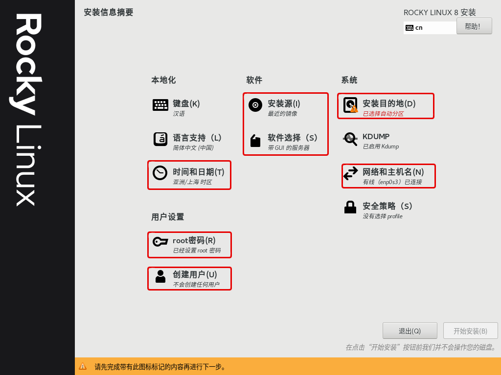
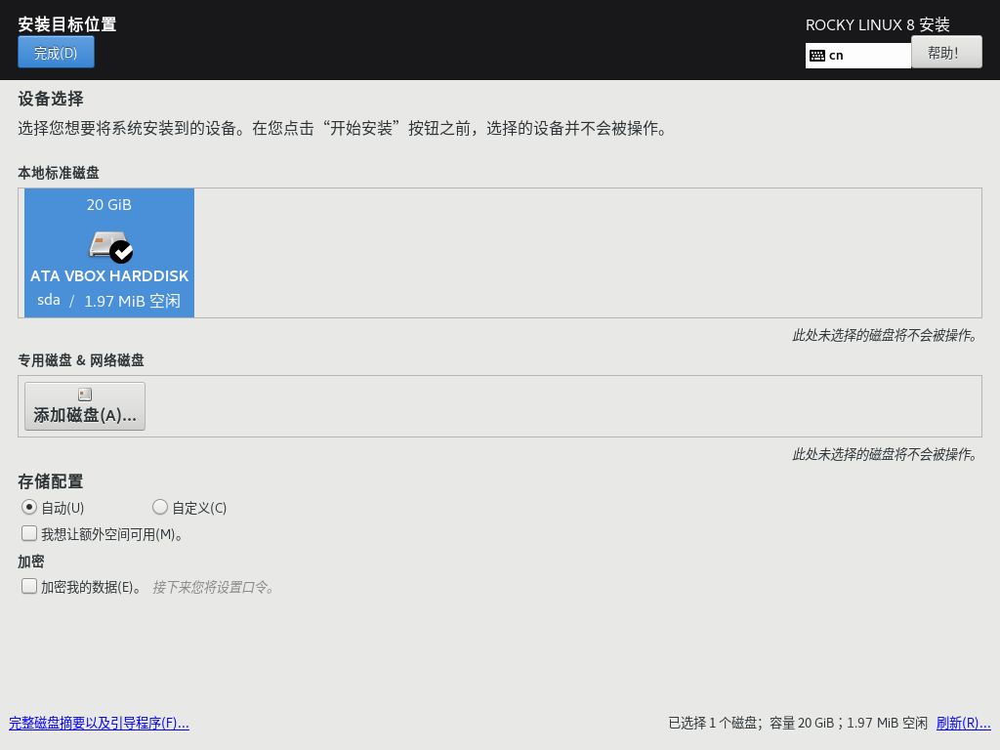
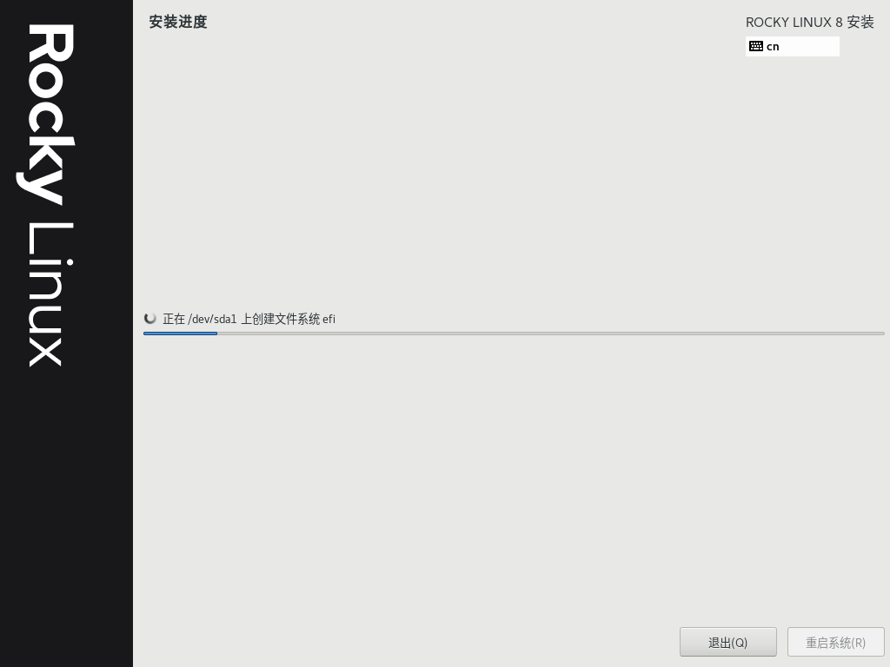

# 准备 Linux 环境

> 🕮 **引言**
>
> 从此刻开始搭建 Linux 环境，**没有环境就无法运行 Linux**

## 1、安装与配置

在开始之前，首先你必须要搭建 Linux 使用环境，在此节中，您可以通过以下方式来进行搭建！

### <a name="m2">Method 1: 虚拟机安装</a>

#### Step 1: 下载虚拟机

此处列举以下软件，请根据自己的需求，选择适合的虚拟机软件即可。

- [Oracle VM VirtualBox](https://www.virtualbox.org/)

- [VMware Workstation Pro](https://www.vmware.com/products/workstation-pro/workstation-pro-evaluation.html)

#### Step 2: 下载 Linux 安装镜像

打开对应的官网下载页面。根据自己设备的硬件架构来安装，比如下载安装 x86_64 的镜像文件。

关于 Linux 发行版，请跳转至 [介绍 Linux - Linux 发行版](../About-Linux.md) 一节

#### Step 3：创建与配置虚拟机

这里就以使用 Oracle VM VirtualBox 7.0.6 安装配置虚拟机为例

1) 打开软件，选择【新建】。
   

2. 在此对话框下，在【Name】项输入虚拟机名称（**名字尽量起英文名**）
   
   
   >💡 **提示**
   >
   >Vbox 使用的类型版本为 Red Hat，VMware 下使用的类型版本为 Red Hat 8 Enterprise Linux
   
   > ❗ **注意**
   >
   > 在 Windows 操作系统下，请务必在【Folder】项修改自己的虚拟机保存位置，以免出现C盘空间不足的情况
   
3. 选择适合的内存大小，这里建议选择 2GB （即 2048 MB）
   

   > 💡 **提示**
   >
   > 勾选【Enable EFI】选项，启动虚拟机时将以 UEFI 形式启动

2. 创建虚拟硬盘，并设置硬盘空间大小。
   

3. 最终确认自己配置的虚拟机信息
   

4. 完成之后点击【启动】，即可开启虚拟机
   

5. 启动后，出现如下对话框，选择自己下载好的安装镜像并载入；完成后，点击【Mount and Retry Boot】。重新启动后即可进入系统安装界面
   

### <a name="m1">Method 2: 双系统安装</a>

#### Step 1: 准备

- 硬件
  - 一个大约 16GB 及以上的 U 盘（USB2.0 及以上版本）
- 软件
  - Linux 镜像文件（一般为 ISO 文件）
  - U 盘写入软件（Ventoy、Rufus）

#### Step 2: 磁盘分区

**在安装 Linux 系统之前，若要将 Linux 系统安装在本机，请提前做好硬盘分区。**

若当前使用的是 Windows 系统，这里建议使用 Windows 磁盘管理进行分区，如下图所例：

**这里仅需留下一个空分区（至少 16G 及以上），此分区用于安装 Linux 系统**

> 💡 **提示**
>
> 空分区用于挂载根 `/` ；EFI 分区无需格式化，在安装系统时，仅需挂载 `/boot/efi` 即可。

#### Step 3: 下载 Linux 安装镜像

打开对应的官网下载页面。根据自己设备的硬件架构来安装，比如下载安装 x86_64 的镜像文件。

关于 Linux 发行版，请跳转至 [介绍 Linux - Linux 发行版](../About-Linux.md) 一节

> 💡 **提示**
>
> 现在，大多数电脑（包括笔记本电脑）都已使用 x86_64 架构的处理器运行，
> **而 Macbook（M1/M2/...）、手机、平板电脑以 ARM64 架构的处理器运行。**

#### Step 4: 下载 U 盘写入软件（Ventoy）

1）首先，点击进入 [Ventoy 官网](https://www.ventoy.net/cn/index.html) 或者 [Github 下载页](https://github.com/ventoy/Ventoy/releases) 进行下载。

2）其次，插入 U 盘，并打开 Ventoy，具体操作如下：

1. 在上方菜单栏点击【配置选项】--> 勾选 【安全启动支持】

2. 点选【安装】，等待即可

   

>💡 **提示**
>
>若您的 U 盘之前安装过 Ventoy 系统，请直接点击【升级】即可。
>
>**注：此操作不会丢失任何文件**

3）完成之后，**请将下载好的镜像文件存入 Ventoy 盘中即可**

> 📚 **扩展**
>
> Ventoy 是一个制作可启动U盘的开源工具。它有以下几个优势：
>
> 1）无需反复地格式化U盘，你只需要把 ISO/WIM/IMG/VHD(x)/EFI 等类型的文件直接拷贝到U盘里面就可以启动了，无需其他操作。你可以一次性拷贝很多个不同类型的镜像文件，Ventoy 会在启动时显示一个菜单来供你进行选择。如下图：
>
> 
>
> 
>
> 
>
> 2）同一个 U 盘可以同时支持 x86 Legacy BIOS、IA32 UEFI、x86_64 UEFI、ARM64 UEFI 和 MIPS64EL UEFI 模式，同时还不影响U盘的日常使用。
>
> 3）Ventoy 支持大部分常见类型的操作系统 （Windows/WinPE/Linux/ChromeOS/Unix/VMware/Xen ...）
>
> 关于 Ventoy 的详细用法，请[点击此处](https://www.ventoy.net/cn/doc_start.html)查看

### <a name="m3">Method 3: 搭建并使用 WSL 环境</a>

> 📚 **扩展**
>
> WSL（Windows Subsystem Linux）是适用于 Linux 的 Windows 子系统。它可让开发人员按原样运行 GNU/Linux 环境 - 包括大多数命令行工具、实用工具和应用程序 - 且不会产生传统虚拟机或双启动设置开销。
>
> 
>
> 关于安装 WSL，请访问下方链接：
>
> https://learn.microsoft.com/zh-cn/windows/wsl/install

## 2、安装 Rocky Linux 操作系统

由于每个 Linux 发行版都有属于自己的安装程序。此节就以安装 [Rocky Linux](../About-Linux.md) 及桌面环境为例。

1. 在启动界面下，使用方向键选择【Install Rocky Linux 8】并按下 <kbd>Enter</kbd> 键
   

   > 💡 **提示**
   >
   > 使用 EFI 与 BIOS 启动时，Grub 引导菜单界面有所不同，下图为 EFI 启动时的引导画面
   >
   > 
   
2. 等待进入系统并载入安装程序界面，在此界面下，选择语言。
   

   

3. 点击下一步后，在【安装信息概要】界面下，您可以在网络良好的情况下选择并做好以下配置（如下红色框选图）。
   如果，你不想做过多的配置，那么您只需要配置好【软件选择】、【安装目的地】、【网络和主机名】、【root密码】即可
   
   
4. 首先在【时间和日期】下，选择亚洲/上海作为默认时区
   

5. 选择【网络和主机名】，将默认的网络打开
   

7. 选择【软件选择】，在这里可以根据自己的情况及需求选择要预装的软件，这里就选择【服务器】，其它选项不变
   

8. 选择【安装目标位置】，在此处选择要安装的硬盘，点击之后完成即可
   
   
   
   
9. 选择【ROOT 密码】，在此处设置 Root 用户密码 
   

   
   
10. *创建普通用户，这里最好设置为管理员身份，以更方便地管理系统操作*
      

    
    
11. 完成以上所有操作，点击【开始安装】。

    

11. 等待完成后，点击【重启系统】完成安装

    
