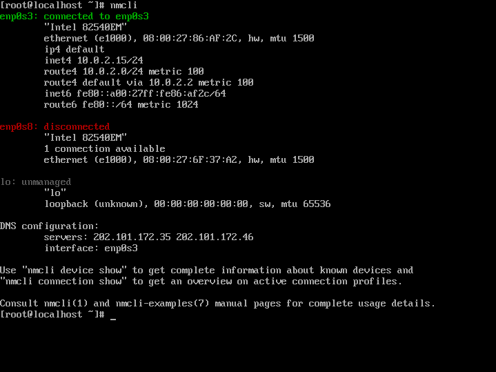

# 准备 Linux 环境

> 🕮 **引言**
>
> 从此刻开始搭建 Linux 环境，**没有环境就无法运行 Linux**

## 1、安装与配置

在开始之前，首先你必须要准备 Linux 使用环境，在此节中，您可以通过以下方式来进行安装！

### <a name="m1">Method 1: 虚拟机安装</a>

#### Step 1: 下载虚拟机

此处列举以下软件，请根据自己的需求，选择适合的虚拟机软件即可。

- [Oracle VM VirtualBox](https://www.virtualbox.org/)

- [VMware Workstation Pro](https://www.vmware.com/products/workstation-pro/workstation-pro-evaluation.html)

#### Step 2: 下载 Linux 安装镜像

打开对应的官网下载页面。根据自己设备的硬件架构来安装，比如下载安装 x86_64 的镜像文件。

关于 Linux 发行版，请跳转至 [介绍 Linux - Linux 发行版](About-Linux.md) 一节

#### Step 3：创建与配置虚拟机

这里就以使用 Oracle VM VirtualBox 7.0.6 安装配置虚拟机为例

1) 打开软件，选择【新建】。
   

2. 在此对话框下，在【Name】项输入虚拟机名称（**名字尽量起英文名**）
   
   
   >💡 **提示**
   >
   >Vbox 使用的类型版本为 Red Hat，VMware 下使用的类型版本为 Red Hat 8 Enterprise Linux
   
   > ❗ **注意**
   >
   > 在 Windows 操作系统下，请务必在【Folder】项修改自己的虚拟机保存位置，以免出现C盘空间不足的情况
   
3. 选择适合的内存大小，这里建议选择 2GB （即 2048 MB）
   

   > 💡 **提示**
   >
   > 勾选【Enable EFI】选项，启动虚拟机时将以 UEFI 形式启动

2. 创建虚拟硬盘，并设置硬盘空间大小。
   

3. 最终确认自己配置的虚拟机信息
   

4. 完成之后点击【启动】，即可开启虚拟机
   

5. 启动后，出现如下对话框，选择自己下载好的安装镜像并载入；完成后，点击【Mount and Retry Boot】。重新启动后即可进入系统安装界面
   

### <a name="m2">Method 2: 双系统安装</a>

#### Step 1: 准备

- 硬件
  - 一个大约 16GB 及以上的 U 盘（USB2.0 及以上版本）
- 软件
  - Linux 镜像文件（一般为 ISO 文件）
  - U 盘写入软件（Ventoy、Rufus）

#### Step 2: 磁盘分区

**在安装 Linux 系统之前，若要将 Linux 系统安装在本机，请提前做好硬盘分区。**

若当前使用的是 Windows 系统，这里建议使用 Windows 磁盘管理进行分区，如下图所例：


**这里仅需留下一个空分区（至少 16G 及以上），此分区用于安装 Linux 系统**

> 💡 **提示**
>
> 空分区用于挂载根 `/` ；EFI 分区无需格式化，在安装系统时，仅需挂载 `/boot/efi` 即可。

#### Step 3: 下载 Linux 安装镜像

打开对应的官网下载页面。根据自己设备的硬件架构来安装，比如下载安装 x86_64 的镜像文件。

关于 Linux 发行版，请跳转至 [介绍 Linux - Linux 发行版](../About-Linux.md) 一节

> 💡 **提示**
>
> 现在，大多数电脑（包括笔记本电脑）都已使用 x86_64 架构的处理器运行，
> **而 Macbook（M1/M2/...）、手机、平板电脑以 ARM64 架构的处理器运行。**

#### Step 4: 下载 U 盘写入软件（Ventoy）

1）首先，点击进入 [Ventoy 官网](https://www.ventoy.net/cn/index.html) 或者 [Github 下载页](https://github.com/ventoy/Ventoy/releases) 进行下载。

2）其次，插入 U 盘，并打开 Ventoy，具体操作如下：

1. 在上方菜单栏点击【配置选项】--> 勾选 【安全启动支持】

2. 点选【安装】，等待即可

   

>💡 **提示**
>
>若您的 U 盘之前安装过 Ventoy 系统，请直接点击【升级】即可。
>
>**注：此操作不会丢失任何文件**

3）Ventoy 会分出两个分区，一个是用于引导的分区（普遍占用小于 1GB 的空间），另一个是用于存放各种文件的分区。
**请将下载好的镜像文件复制到 Ventoy 分区即可。**

4）完成之后，请重启自己的电脑，并以 U 盘方式启动 Ventoy 引导即可。

> 📚 **扩展**
>
> 关于各品牌的启动快捷方式，请详见下表：
>
> 【台式机】
>
> | 主板品牌     | 快捷键   |
> | ------------ | -------- |
> | 技嘉主板     | F12      |
> | 微星主板     | F11      |
> | 映泰主板     | F9       |
> | 梅捷主板     | ESC或F12 |
> | 七彩虹主板   | ESC或F11 |
> | 华擎主板     | F11      |
> | 斯巴达卡主板 | ESC      |
> | 昂达主板     | F11      |
> | 双敏主板     | ESC      |
> | 翔升主板     | F10      |
> | 精英主板     | ESC或F11 |
> | 冠盟主板     | F11或F12 |
> | 富士康主板   | ESC或F12 |
> | 顶星主板     | F11或F12 |
> | 铭瑄主板     | ESC      |
> | 盈通主板     | F8或F11  |
> | 捷波主板     | ESC      |
> | Intel主板    | F12      |
> | 杰微主板     | ESC或F8  |
> | 致铭主板     | F12      |
> | 磐英主板     | ESC      |
> | 磐正主板     | ESC      |
> | 冠铭主板     | F9       |
> | 军工主板     | F11      |
>
>  【笔记本】
>
> | 笔记本品牌     | 快捷键 |
> | -------------- | ------ |
> | 联想笔记本     | F12    |
> | 华硕主板       | F8     |
> | 宏基笔记本     | F12    |
> | 华硕笔记本     | ESC    |
> | 惠普笔记本     | F9     |
> | 联想Thinkpad   | F12    |
> | 戴尔笔记本     | F12    |
> | 神舟笔记本     | F12    |
> | 东芝笔记本     | F12    |
> | 三星笔记本     | F12    |
> | IBM笔记本      | F12    |
> | 富士通笔记本   | F12    |
> | 海尔笔记本     | F12    |
> | 方正笔记本     | F12    |
> | 清华同方笔记本 | F12    |

> 📚 **扩展**
>
> Ventoy 是一个制作可启动U盘的开源工具。它有以下几个优势：
>
> 1）无需反复地格式化U盘，你只需要把 ISO/WIM/IMG/VHD(x)/EFI 等类型的文件直接拷贝到U盘里面就可以启动了，无需其他操作。你可以一次性拷贝很多个不同类型的镜像文件，Ventoy 会在启动时显示一个菜单来供你进行选择。如下图：
>
> 
>
> 
>
> 
>
> 2）同一个 U 盘可以同时支持 x86 Legacy BIOS、IA32 UEFI、x86_64 UEFI、ARM64 UEFI 和 MIPS64EL UEFI 模式，同时还不影响U盘的日常使用。
>
> 3）Ventoy 支持大部分常见类型的操作系统 （Windows/WinPE/Linux/ChromeOS/Unix/VMware/Xen ...）
>
> 关于 Ventoy 的详细用法，请 🔗[点击此处](https://www.ventoy.net/cn/doc_start.html) 查看


### <a name="m3">Method 3: 搭建并使用 WSL 环境</a>

> 🔗 **相关内容**
>
> *WSL（Windows Subsystem Linux）是适用于 Linux 的 Windows 子系统。它可让开发人员按原样运行 GNU/Linux 环境 - 包括大多数命令行工具、实用工具和应用程序 - 且不会产生传统虚拟机或双启动设置开销。*
>
> 关于安装 WSL，请访问下方链接：
>
> https://learn.microsoft.com/zh-cn/windows/wsl/install


## 2、安装 Linux 操作系统

由于每个 Linux 发行版都有属于自己的安装程序。此节就以安装 [Rocky Linux](../About-Linux.md) 为例。

1. 在启动界面下，使用方向键选择【Install Rocky Linux 8】并按下 <kbd>Enter</kbd> 键
   

   > 💡 **提示**
   >
   > 使用 EFI 与 BIOS 启动时，Grub 引导菜单界面有所不同，下图为 EFI 启动时的引导画面
   >
   > 
   
2. 等待进入系统并载入安装程序界面，在此界面下，选择语言。
   

   

3. 点击下一步后，在【安装信息概要】界面下，您可以在网络良好的情况下选择并做好以下配置（如下红色框选图）。
   如果，你不想做过多的配置，那么您只需要配置好【软件选择】、【安装目的地】、【网络和主机名】、【root密码】即可
   
   
4. 首先在【时间和日期】下，选择亚洲/上海作为默认时区
   

5. 选择【网络和主机名】，将默认的网络打开
   

7. 选择【软件选择】，在这里可以根据自己的情况及需求选择要预装的软件，这里就选择【服务器】，其它选项不变
   

8. 选择【安装目标位置】，在此处选择要安装的硬盘，点击之后完成即可
   
   
   
   
9. 选择【ROOT 密码】，在此处设置 Root 用户密码 
   

   
   
10. *创建普通用户，这里最好设置为管理员身份，以更方便地管理系统操作*
      

    
    
11. 完成以上所有操作，点击【开始安装】。

11. 等待完成后，点击【重启系统】完成安装

    
    
12. 重启完成后，仅需在如下图所示中，输入用户 `root` 以及密码完成登录。

    


> 📚 **扩展**
>
> 若对此界面感到不适应，您可以尝试安装桌面环境
>
> 这里就以安装 GNOME 桌面环境为例：
>
> 1. 首先，请检查软件源，此处无需更新，按下 `N` 即可
>
>    ```java
>    [root@localhost ~]# yum update 
>    ```
>
> 2. 执行以下指令，安装 GNOME 包组；将其设置默认开机运行并重新启动
>
>    ```java
>    yum groupinstall "GNOME" -y && systemctl set-default graphical.target && restart
>    ```
>
>    该步骤需要花费较长的时间
>    
>    > 💡 **提示**
>    >
>    > 多次使用 <kbd>Tab</kbd> 键可加快输入命令的效率
>
> 完成上述操作后，您只需要选择你创建好的用户并输入用户密码即可登录
>
> 
>
> 若需要以 ROOT 身份登录，请直接点击【未列出】（GNOME 环境下）或【其它用户】，然后输入用户名`root`及其密码即可登录！

## 3、远程登录终端

> 🕮 **引言**
>
> **终端**（Computer Terminal），是一台电脑或者计算机系统，用来让用户输入数据，及显示其计算结果的机器，简而言之就是人类用户与计算机交互的设备。
>
> [源自[维基百科](https://zh.wikipedia.org/wiki/%E7%B5%82%E7%AB%AF)]

为了方便使用 Linux 系统，您可以通过连接外部终端来访问。下面将介绍如何实现远程登录

### 1）选择终端软件

以下选项仅列举部分适合新手方便安装的软件

| 软件                                                         | 描述                                                   | 支持的操作系统      |
| ------------------------------------------------------------ | ------------------------------------------------------ | ------------------- |
| 🔗 [Microsoft Windows Terminal](https://apps.microsoft.com/store/detail/windows-terminal/9N0DX20HK701?hl=en-gb&gl=gb&rtc=1) | 微软官方的终端工具                                     | Windows             |
| 🔗 [MobaXterm](https://mobaxterm.mobatek.net/)                | 一款很强大且好用的终端工具                             | Windows             |
| 🔗 **[Tabby](https://tabby.sh/)**                             | 一个更炫酷，而且主题丰富，功能强大，最主要的是**开源** | MacOS+Linux+Windows |

### 2）使用 SSH 连接虚拟机

#### 1. 添加新的网卡

1. 以 Virtual Box 为例，首先请**关闭当前虚拟机**并点开虚拟机中的【设置】。
   在设置界面下，请依次选择【网络】–>【网卡 2】并勾选【启用网络连接】，之后做如下图设置：
   
   
2. 完成之后，请再次开启虚拟机

3. 在自己的 Linux 系统中输入 `nmcli` 获取自己的网卡信息。一般情况下，会获取到由 `enp` 为头的网络设备所提供的 IP 地址。如下图：
   

   可以发现，这里的第二个网卡没有被激活，因此我们需要对其激活该网络。执行如下：
   
   ```java
   [root@localhost ~]# nmcli connection up path 2
   ```

4. 之后再次执行 `nmcli` ，可以发现已经成功激活第二个网络，并获取到第二个网卡的 IP 地址为 `192.168.56.102`.
   

   > 💡 **提示**
   >
   > 为了更好地尝试是否成功连接到虚拟机里的网络，**你可以打开自己电脑下的【命令提示符】或终端** ，并尝试 ping 第二个网卡的 IP 地址，执行命令如下：
   >
   > ```java
   > ping 192.168.56.102
   > ```
   >
   > 另外，你还可以在虚拟机内部为第二个网卡设置**开机自动连接网络**，这样以后再次开启虚拟机时就无需反复执行指令。执行方式如下：
   >
   > ```java
   > [root@localhost ~]# nmcli connection modify path 2 connection.autoconnect true
   > ```

#### 2. 连接 SSH

1. 打开自己的终端软件。

2. 输入以下指令：`$ ssh root@<你的网络 IP 地址>`（这里就以 `192.168.56.102` 为例）

3. 出现如下提示后，输入 【Yes】，回车并输入 `root` 用户的密码即可登录

   ```java
   The authenticity of host '192.168.56.102 (192.168.56.102)' can't be established.
   ECDSA key fingerprint is SHA256:Mmm4Ju7BTAVNUo32vdgWFghdW2QJpAYqL/W/zgA5jgM.
   Are you sure you want to continue connecting (yes/no/[fingerprint])? yes
   Warning: Permanently added '192.168.56.102' (ECDSA) to the list of known hosts.
   root@192.168.56.102's password: 
   Web console: https://localhost:9090/ or https://10.0.2.15:9090/
   
   Last login: Sun Feb 19 06:44:06 2023 from 192.168.56.1
   [root@localhost ~]# 
   ```

4. 如果想要退出当前 SSH，请输入指令：`exit` / `logout` 或按下快捷键 <kbd>Ctrl</kbd> + <kbd>D</kbd> 退出 SSH 连接

> 🔗 **相关内容**
>
> 至此，您已经完成了所有安装步骤，接下来您可以直接跳转至下一章节：
>
> - [开始学习 SHELL](Shell.md)
